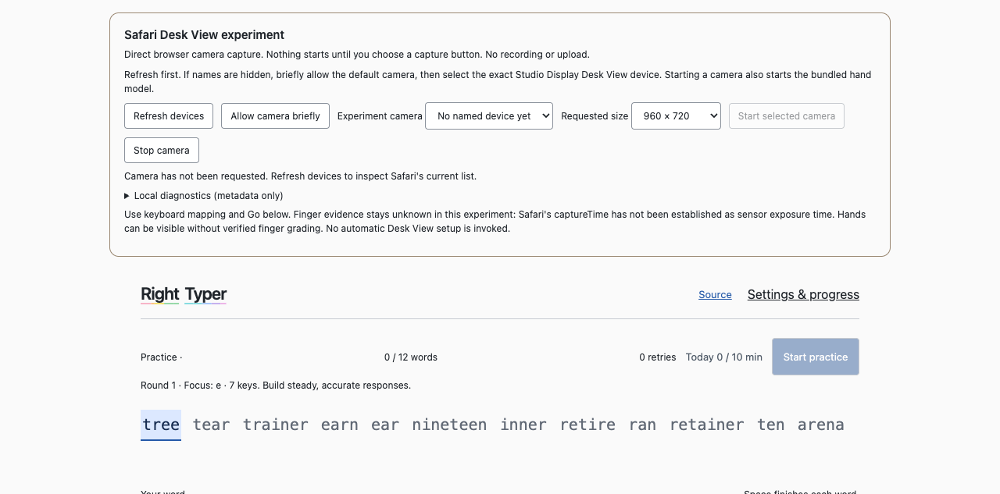

# Safari direct Desk View experiment

Experimental ALO-180 research; not production browser support or finger-training acceptance.

Run `pnpm install --frozen-lockfile` then `pnpm dev --port 5182 --strictPort`.
Open <http://127.0.0.1:5182/?safariDeskView=1> in Safari when the shared camera slot is available. This development server serves static browser code and bundled assets; it does not bridge or receive camera data.

The experiment adds explicit device enumeration, permission probing, exact camera selection, resolution requests and local metadata diagnostics to the existing Right Typer calibration/practice loop. No capture starts at page load. All inference remains in the bundled MediaPipe classic worker. No native helper, extension, upload, cloud inference, or recording is involved.

## Current evidence

- Build, TypeScript, lint and 326 unit tests pass.
- Chromium fake camera: real bundled model loads and infers with same-origin requests only. Synthetic tests exercise exact selection, stop, permission-probe cleanup, absent VideoFrame, unavailable timing and calibration/text practice. These are software checks, not Safari/hardware evidence.
- Eight focused Chromium browser cases pass (seven in the combined run, the corrected feedback-text assertion rerun separately): camera lifecycle, real-model startup, experiment capture controls, calibration and honest unknown word advancement.
- Camera-free isolated Chromium UI inspection passes; screenshot below contains no camera image.

- Installed Safari 26.6.2: **not tested yet**. Device listing, exact Studio Display Desk View capture, real hands, resolution/rate, setup prerequisite and calibration/typing remain pending the manager's camera/UI slot.
- An older cached Playwright WebKit runtime did not initialize with the current automation protocol and was stopped. This supplies no evidence about the installed Safari.

## Timing limitation

[WebKit camera discovery](https://github.com/WebKit/WebKit/blob/main/Source/WebCore/platform/mediastream/cocoa/AVVideoCaptureSource.mm#L918-L944) includes Desk View cameras. This is source evidence, not proof of installed Safari enumeration or successful capture.

The same file's [AVFoundation sample-delivery callback](https://github.com/WebKit/WebKit/blob/main/Source/WebCore/platform/mediastream/cocoa/AVVideoCaptureSource.mm#L1427-L1437) sets `metadata.captureTime` using `MonotonicTime::now()` after creating the video frame from the delivered sample. That callback does not read sensor exposure time. The [rVFC specification](https://wicg.github.io/video-rvfc/) describes local captureTime as camera capture time; field presence alone cannot settle this provenance question. Current upstream source is not a verified mapping to the installed Safari binary.

The explicit experiment therefore sets `captureClockTrusted = false`; every inference result carries `clock: unavailable`. Raw browser timestamps remain visible for investigation. Callback time supplies monotonic inference ordering only. No callback, presentation, media, VideoFrame-constructor or inference completion timestamp is promoted to exposure evidence. Correct text can advance with unknown observations, as existing product rules allow; finger training remains unaccepted. Ordinary non-experiment capture and classifier rules are unchanged.

This does **not** show that Safari can never grade fingers. A measured timing relationship with stable offset and bounded uncertainty may be viable. This prototype applies no offset and changes no production classifier.

## Live test, after slot grant

1. Open the URL in Safari. Select **Refresh devices** before requesting capture and inspect the list. Hidden labels or IDs before permission are not proof that a camera is unavailable.
2. If needed, select **Allow camera briefly** and allow Camera for this localhost page. The resulting stream is immediately stopped. A denial is reported once; allow Camera in Safari's website settings before retrying. Do not change global privacy settings or interrupt another app's camera session.
3. Refresh and select the exact **Studio Display Desk View Camera**, then **Start selected camera**. Selection uses `deviceId: { exact: ... }`; it cannot silently fall back to a different camera. If absent after permission, have Al start Apple's existing Desk View setup, complete framing, then refresh and compare. Do not install a helper.
4. Open diagnostics. Record only non-sensitive text: browser version, selected/actual label, track dimensions/rate, worker ready/error, latest inferred hand count, raw captureTime availability and callback rate. Test 960×720 and 1920×1440 requests separately; actual track settings are the result, requested sizes are not guarantees.
5. If preview/model work, use **Settings & progress → Camera & keyboard** to mark key centres, then **Start practice**. Use real correct typing and deliberate wrong fingers to assess visible tracking/focus/recovery; all finger observations must remain unknown in this experiment. Do not interpret word advancement as finger compliance.
6. Stop with **Stop camera**. Verify preview/track release. Refresh devices after any hardware/setup change. Changes in crop/zoom/framing can invalidate alignment even when ID and dimensions remain the same; recheck the map manually.

A selectable camera or moving preview alone is partial success. A model error, missing API, inaccessible device or timing limitation must be reported at its actual stage. No raw camera screenshots/video should be saved or published for this test.

## Next timing measurement if direct capture works

Use at least 30 separated visible key contacts with one finger, then a faster sequence, repeating at each resolution and after restart. In memory, associate keydown's normalized time with rVFC metadata and visible fingertip motion before inference transfer; preserve the result's source-frame identity. Report median/tails of event-to-motion offset, variation across runs, metadata regressions, duplicate media timestamps, skipped presented frames, inference skips and contact ambiguity. Stationary hands do not establish duplicate images; presentation counters alone do not establish unique camera exposures.

Initial feasibility can be assessed with repeated user-confirmed staged presses, offset/jitter estimates and held-out correct/wrong-finger observations, with the evidence and its limits explicitly labeled. That comparison includes switch scan delay, contact mechanics and tracking error. A separately bounded optical timing reference in the camera field is an optional way to strengthen timestamp provenance; account for its own display/update delay if used. It is not an agreed product requirement or a prerequisite for this initial feasibility test. No raw footage recording is authorized; any such recording needs explicit user permission. Do not subtract a fitted mean and call it sensor exposure. Define a conservative uncertainty interval and verify held-out presses and dropped/delayed cases before proposing grading changes to the liaison. This prototype continues to report finger observations as unknown.

## Recovery

Owner: Safari research spike task `01a09f2e-1296-76c1-8026-c9d2e0e1afe0`; coordinator `01a09f24-9e2b-7a02-8f22-24b4e3804c1d` (local). Branch `codex/safari-desk-view-spike`, independent from main `8b7f601377700e6dfc472996baaddfe799766950`; no stack parent or production deployment. Manager grants shared Safari/camera access. Local server uses port 5182. Exact current head and latest acceptance evidence belong in the draft PR.
