# Keyboard fidelity audit — ALO-265

The six presets now draw the complete **typing block**, from the number row through Space. Function rows and the PC navigation/numpad blocks are outside the diagram. The reference model and operating-system language are explicit in the selector. ANSI/ISO alone does not identify a whole keyboard; other hardware remains a custom profile.

## What changed

Previously the renderer filtered physical keys through the passage's letter/comma/period outputs. This hid punctuation, ISO's extra key, Return and modifiers, and left German/French regional keys floating above the letters. All six presets now have a continuous number row, punctuation legends, correct left Shift and Return silhouettes, and a complete bottom row. MacBook's right edge is half a key pitch narrower than the V6's; Delete, Return and right Shift follow their own hardware reference.

`src/view/hardware.ts` separates illustration geometry and printed legends from `KeyboardProfile` practice outputs. Numbers, modifiers and secondary legends are context, not new exercises or camera targets. Modifier symbols are simplified teaching labels, not a keycap facsimile. Existing finger colors, uppercase letter legends, blank Space/either-thumb annotation, and flat F/J ridges remain. On narrow screens finger captions yield to readable legends; colors, accessible names and Space's annotation remain.

## Primary references, checked 10 September 2026

- Apple [Link Bar Keys](https://support.apple.com/en-mide/101271) explicitly groups MacBook Air M2 or later with 14/16-inch MacBook Pro 2021 or later. Its [ANSI map](https://cdsassets.apple.com/live/SZLF0YNV/service-documentation/ssr/boilerplates/keys-for-laptops/link-bar/LayoutA_KBD_ANSI_linkbar.jpg) and [ISO map](https://cdsassets.apple.com/live/SZLF0YNV/service-documentation/ssr/boilerplates/keys-for-laptops/link-bar/LayoutA_KBD_ISO_linkbar.jpg) independently show key proportions, stagger, bottom row and Return silhouettes. Coordinates are normalized visual proportions, not millimetre specifications.
- Apple's [MacBook Air keyboard guide](https://support.apple.com/guide/macbook-air/magic-keyboard-apdab672d5e9/mac) supplies the [US legend illustration](https://help.apple.com/assets/68E55784E266DE1F4A0ACA56/69726E59320F229D6106C907/en_US/a285052250496e01516c2dc53c15513e.png). [Regional identification](https://support.apple.com/en-gb/102743) supplies [British/Irish distinguishing legends](https://cdsassets.apple.com/live/7WUAS350/images/accessories/keyboards/mac-keyboard-id-iso-british-irish.png). British uses §/± at top left, @ on 2, £ on 3, and grave/tilde beside short Shift. Its geometry comes from the ISO repair map, not the US guide image.
- Keychron [V6 regional keycap photographs](https://keychron.de/en/products/keychron-v6-qmk-custom-mechanical-keyboard-iso-layout-collection): [British](https://cdn.shopify.com/s/files/1/0591/6318/1193/t/3/assets/v6ukkeycap-1676882070458-1677482847027.jpg), [German](https://cdn.shopify.com/s/files/1/0591/6318/1193/t/3/assets/v6germankeycap-1676882034042-1677482816959.jpg), [French](https://cdn.shopify.com/s/files/1/0591/6318/1193/t/3/assets/v6frenchkeycap-1676882105768-1677482872907.jpg). The photographs show fitted Mac caps **and loose Windows replacements**; PC presets use the Windows replacements. French is legacy AZERTY, not the newer standardized layout. The diagram shows the reference keycaps' legends, not every possible OS output.
- Keychron V6 [ANSI QMK geometry](https://github.com/qmk/qmk_firmware/blob/08c662f286ddfd12a985f57b584b02eca5af0ae6/keyboards/keychron/v6/ansi/keyboard.json) and [ISO QMK geometry](https://github.com/qmk/qmk_firmware/blob/08c662f286ddfd12a985f57b584b02eca5af0ae6/keyboards/keychron/v6/iso/keyboard.json) provide numeric positions and dimensions. Subtract Q's x=1.5/y=2.25 for the app axes. The [ANSI product](https://www.keychron.com/products/keychron-v6-qmk-custom-mechanical-keyboard) identifies the US model.

## Reference versus render

Dimensions below are key pitches, including uniform gutters. Q is (0,0); A is (.25,1), Z is (.75,2) for every reference. MacBook Space spans C through M. PC Space is the V6's 6.25-unit bar; neither language nor ISO implies that bottom row on other keyboards.

| Preset                           | Space x / width | Left / right Shift width | Return                   | Regional checks                                                                | Desktop / mobile render                                                                             |
| -------------------------------- | --------------- | ------------------------ | ------------------------ | ------------------------------------------------------------------------------ | --------------------------------------------------------------------------------------------------- |
| US · V6 ANSI / Windows           | 2.25 / 6.25     | 2.25 / 2.75              | horizontal 2.25          | 2/@, '/", backslash/pipe above Return                                          | [Desktop](images/fidelity/us-ansi-1440.png) · [Mobile](images/fidelity/us-ansi-390.png)             |
| British · V6 ISO / Windows       | 2.25 / 6.25     | 1.25 / 2.75              | ISO 1.5 top / 1.25 lower | 2/", 3/£, '/@, #/~ beside Return, backslash/pipe beside Shift                  | [Desktop](images/fidelity/gb-iso-1440.png) · [Mobile](images/fidelity/gb-iso-390.png)               |
| British · MacBook ISO / macOS    | 2.75 / 5        | 1.25 / 2.25              | ISO 1 top / .75 lower    | §/±, 2/@, 3/£, grave/tilde beside Shift                                        | [Desktop](images/fidelity/apple-gb-iso-1440.png) · [Mobile](images/fidelity/apple-gb-iso-390.png)   |
| German · V6 ISO / Windows        | 2.25 / 6.25     | 1.25 / 2.75              | ISO 1.5 top / 1.25 lower | Z/Y, Ü/Ö/Ä, ß/?, +/\*/~, #/', </>/pipe                                         | [Desktop](images/fidelity/de-iso-1440.png) · [Mobile](images/fidelity/de-iso-390.png)               |
| French legacy · V6 ISO / Windows | 2.25 / 6.25     | 1.25 / 2.75              | ISO 1.5 top / 1.25 lower | AZERTY, M beside L, é/è/ç/à/ù, comma/? then semicolon/period, colon/slash, !/§ | [Desktop](images/fidelity/fr-iso-1440.png) · [Mobile](images/fidelity/fr-iso-390.png)               |
| US · MacBook ANSI / macOS        | 2.75 / 5        | 2.25 / 2.25              | horizontal 1.75          | US symbols, 1-unit backslash, 1.5-unit Delete                                  | [Desktop](images/fidelity/apple-us-ansi-1440.png) · [Mobile](images/fidelity/apple-us-ansi-390.png) |

## Saved setup and verification

Practice coordinates, output mappings, calibration target sets and camera compatibility checks are unchanged. A unit regression compares every existing preset physical coordinate with its illustrated counterpart. Added context cannot enter the calibration or grading path. Custom profiles bypass the stock illustration and retain their coordinates and outputs. PR35's original snapshot retention and compatibility checks remain in force; recordings are not rewritten.

`e2e/hardware-fidelity.spec.ts` creates all six setups through the UI, checks enabled practice, reloads each saved map, compares points/device/profile, and verifies manufacturer anchors at 1440px and 390px for both routes. Existing tests additionally cover old pre-PR34 storage, PR34's generated profile, custom edits, incompatible French switching and French passage completion. Synthetic camera evidence verifies software continuity, not physical-camera accuracy.

## Visual comparison gallery

Manufacturer originals remain hosted by their owners; the app screenshots are local test artifacts. The V6 regional photos include the loose Windows replacement caps below the board. Compare those replacements when reading the PC legends.

### us-ansi

| Manufacturer reference                                                                                                                                                                                                     | Render                                              |
| -------------------------------------------------------------------------------------------------------------------------------------------------------------------------------------------------------------------------- | --------------------------------------------------- |
|  | 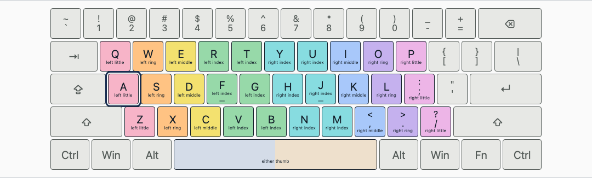 |

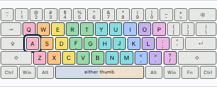

### gb-iso

| Manufacturer reference                                                                                                        | Render                                             |
| ----------------------------------------------------------------------------------------------------------------------------- | -------------------------------------------------- |
|  | 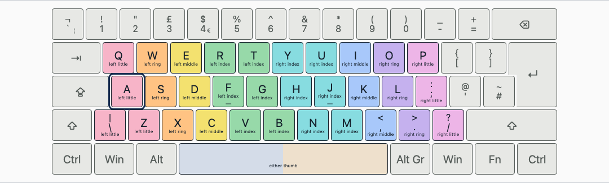 |

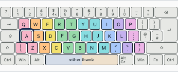

### de-iso

| Manufacturer reference                                                                                                            | Render                                             |
| --------------------------------------------------------------------------------------------------------------------------------- | -------------------------------------------------- |
|  | 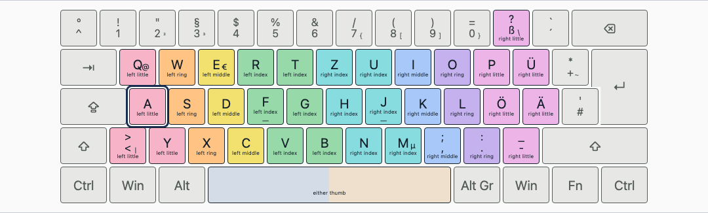 |

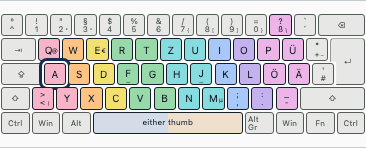

### fr-iso

| Manufacturer reference                                                                                                            | Render                                             |
| --------------------------------------------------------------------------------------------------------------------------------- | -------------------------------------------------- |
|  | 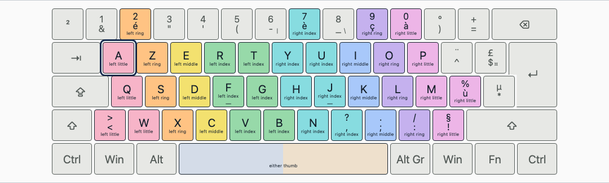 |

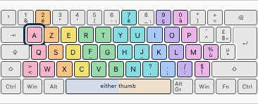

### apple-us-ansi

| Manufacturer reference                                                                                                                            | Render                                                    |
| ------------------------------------------------------------------------------------------------------------------------------------------------- | --------------------------------------------------------- |
|  | 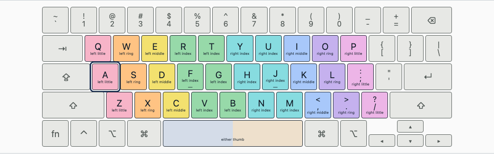 |

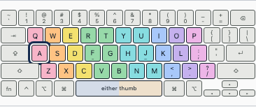

### apple-gb-iso

| Manufacturer reference                                                                                                                                        | Render                                                   |
| ------------------------------------------------------------------------------------------------------------------------------------------------------------- | -------------------------------------------------------- |
|  | 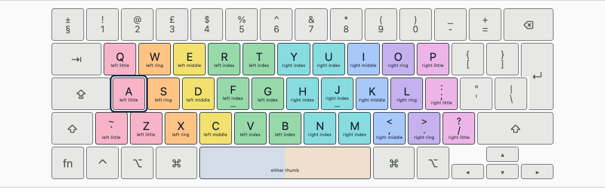 |

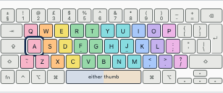
