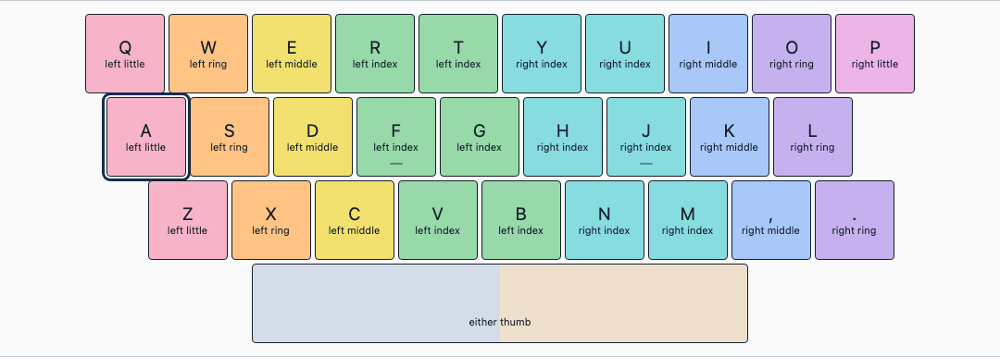
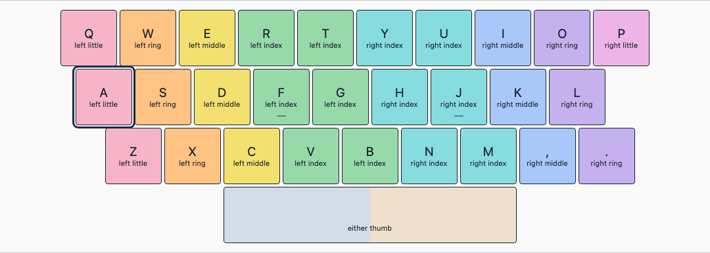
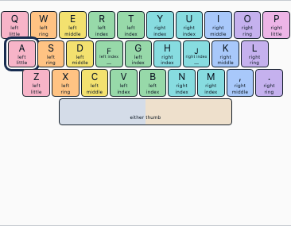
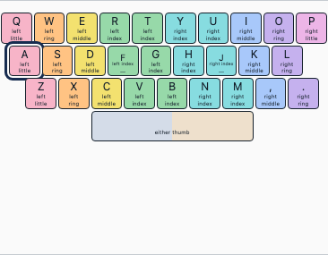

# Hardware geometry and saved camera maps

MacBook British ISO and MacBook US ANSI Space spans physical C's left edge to M's right edge: x=2.75, width=5 key pitches, relative to Q at x=0. Equal key-cell padding makes the visible edges coincide, including mobile gutters. PC presets use the conventional 6.25-pitch bottom row: x=2.25, width=6.25. Language or ANSI/ISO alone cannot identify a bottom row; arbitrary custom coordinates remain untouched.

## Hardware evidence (checked 2026-09-09)

- **MacBook US:** Apple's [MacBook Air guide](https://support.apple.com/guide/macbook-air/magic-keyboard-apdab672d5e9/mac) links its [US keyboard illustration](https://help.apple.com/assets/68E55784E266DE1F4A0ACA56/69726E59320F229D6106C907/en_US/a285052250496e01516c2dc53c15513e.png). Horizontal Return/long left Shift identify ANSI. Space's visible edges match C and M. A→Q stagger is 0.25 pitch, Z→Q 0.75. This is visual proportion evidence, not a millimetre specification or a claim about every historical MacBook.
- **MacBook British:** Al's actual British MacBook observation in [ALO-264](https://linear.app/advantagegroup/issue/ALO-264) establishes the same C–M edges. Apple's [layout identification](https://support.apple.com/en-gb/102743) distinguishes British ISO by its Return/region symbols. Apple's UK Air guide reuses the US illustration, so it is not independent British geometry evidence.
- **Conventional PC:** [Keychron V6 product photo](https://www.keychron.com/products/keychron-v6-qmk-custom-mechanical-keyboard) visibly has the wider bottom-row bar. Its QMK [ANSI](https://github.com/qmk/qmk_firmware/blob/08c662f286ddfd12a985f57b584b02eca5af0ae6/keyboards/keychron/v6/ansi/keyboard.json) and [ISO](https://github.com/qmk/qmk_firmware/blob/08c662f286ddfd12a985f57b584b02eca5af0ae6/keyboards/keychron/v6/iso/keyboard.json) layouts both specify Q x=1.5, A x=1.75, Z x=2.25 and Space x=3.75/w=6.25. Subtracting Q gives the app coordinates above. This corrects the old approximate PC x=2/w=6; it does not claim every PC keyboard uses this bottom row. Custom JSON supports other hardware.

## Existing users: correct drawing, no unnecessary remap

The initial PR34 retained old British drawing as a custom profile. That upgrade behavior was rejected. Existing stock British setups now retain their selected built-in and receive corrected drawing automatically. Exact stock copies generated by PR34 also upgrade; custom geometry or finger-policy edits do not.

No camera coordinate is inferred from the drawing. Space attribution projects onto the two **clicked camera endpoints**. Letter axes use calibrated letter positions; there is no point named `Space`, so its drawing rectangle is excluded from their neighbors. ANSI/ISO names do not enter that calculation either. `calibrationGeometrySignature` therefore compares the actual calibrated non-Space coordinates and target set. Changes to those positions still require remapping. Camera identity/dimensions checks remain unchanged.

Safe built-in corrections preserve every point, hand-swap setting and camera identity. `calibrationHistory` retains the original complete calibration/profile snapshot; `legacyCalibration` still retains the original profile-less data. The active snapshot uses the corrected preset, avoiding disagreement between exported/current geometry and the drawing. Existing recording bundles are never rewritten. Profiles and calibration remain version 1; recording/press schema and grading rules are unchanged.

A US PC selection remains PC. Choosing the actual MacBook US or British preset is explicit and can reuse the map when the calibrated coordinates agree. The browser cannot infer attached hardware from the operating system. Reset still clears local data.

## Upgrade evidence

`tests/fixtures/alo264-british-pre34.json` was saved by unmodified production commit `ae0a287` after selecting British, clicking all 30 camera positions and starting practice in Chromium with synthetic video. It is an actual old-app storage artifact, not new-profile data relabelled as old. It contains no real camera footage or personal data.

At 1440px, old C-left=519.5/M-right=965.5 versus Space-left=452/right=988. At 390px, old C-left=113.640625/M-right=294.640625 versus Space-left=86.1875/right=303.78125. Upgrade tests load that artifact, compare new visible edges, verify all camera points unchanged, reload and resume. Additional scenarios cover PR34 generated copies, PC selection/manual MacBook adoption and genuine custom geometry.

Core regression checks compare every calibrated letter axis, all key/Space distances on a 121-point camera grid and synthetic observations before/after. This establishes software equivalence for this correction, not physical-camera tracking accuracy.

The same saved fixture after upgrade has Space=519.5..965.5 at 1440px and 113.640625..294.640625 at 390px: both visible edge errors are 0px. All 30 camera positions survive startup, refresh/resume and explicit PC→MacBook selection unchanged.

| View    | Old production setup                       | Automatic upgrade                        |
| ------- | ------------------------------------------ | ---------------------------------------- |
| Desktop |  |  |
| Mobile  |   |   |
