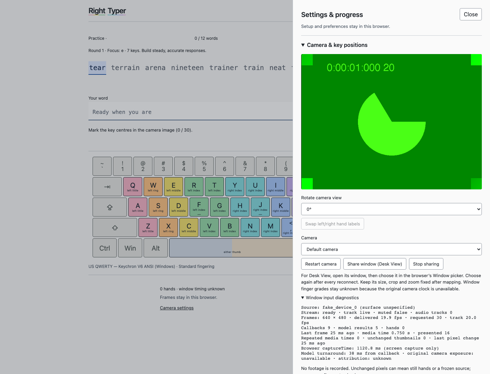

# Experimental Desk View window input

ALO-180 research spike; browser-only local prototype, not production acceptance. Based on main `8b7f601`. No model/grading heuristic changes. No native helper, extension, backend or upload.

Run `pnpm install --frozen-lockfile && pnpm dev --port 5181 --strictPort`, then open <http://127.0.0.1:5181/?input=window>. This URL opens setup without automatically opening a webcam. The normal URL keeps existing camera startup behavior. Share window is also available beside the camera controls.

## Hands-on check (no recording)

1. Start Desk View and frame the keyboard/both hands. Click **Share window (Desk View)** and select its window in the browser picker. Audio is disabled. If macOS denies access, enable this browser under System Settings → Privacy & Security → Screen & System Audio Recording; follow any browser relaunch prompt.
2. Confirm moving fingers appear in the preview. Expand **Window input diagnostics**: check dimensions, delivered rate, model-result count, hand count, native screen timestamp availability and pixel-change age. The labelled skeleton should follow the correct fingers. This needs Al's observation; a model label is not ground truth.
3. Map key centres and both Space endpoints. Choose the correct keyboard preset first if needed. Rotation is available. Keep Desk View's window dimensions, crop and zoom fixed. The prototype does not add another crop/zoom transform.
4. Use **Check an observed finger**, then start practice. Type a word with deliberate correct fingers and another with deliberately wrong fingers. Record Al's stated movements and the UI outcome as written notes only. **Expected limitation: both are unknown finger evidence.** Text can advance, but this experiment does not detect wrong-finger errors.
5. Cover the Desk View window, then minimize and restore it. Move fingers each time. Note whether pixels/results continue, the track mutes, pixel-change age grows, or the stream stops. Still hands and repeated images are not distinguishable automatically. No fresh model result for six seconds ends the stream with recovery guidance.
6. Resize the window: a changed delivered frame size clears mapping and pauses practice. Remap before resuming. Crop/zoom or keyboard movement at unchanged dimensions cannot be detected reliably: use **Remap key positions** yourself.
7. Stop sharing in the app and in the browser's sharing control; close the shared window. Confirm recovery. Reconnect through the picker and map again. Finally choose the webcam and confirm its old map remains available.

## Evidence boundaries

| Boundary           | Independent evidence                                                                          | Physical test                                                                         |
| ------------------ | --------------------------------------------------------------------------------------------- | ------------------------------------------------------------------------------------- |
| Picker/permission  | Options, cancellation and late stream cleanup tested with API substitution                    | Native Chrome picker succeeded; existing permission sufficed                          |
| Window video       | Synthetic browser stream reaches frame snapshots                                              | Actual Desk View capture succeeded at 2464×1848                                       |
| Model              | Real bundled MediaPipe returns frames from fake video, zero hands, only local-origin requests | Live model reported one hand; finger movement/label accuracy awaits user confirmation |
| Timing             | Window frames always marked `unavailable`; available native `captureTime` shown separately    | Original camera exposure is unavailable through this route                            |
| Attribution        | Synthetic visible hands remain unknown and correct text advances                              | No claim of reliable keypress/finger attribution                                      |
| Lifecycle/geometry | Synthetic end/stop/reconnect, resize invalidation and webcam-map preservation tested          | Obscured/minimized/closed native window pending                                       |

The callback clock is used only to order model work and display turnaround. It is never represented as original exposure time. Desk View rendering adds an unmeasured upstream delay even if the browser exposes a screen-capture timestamp. The existing evidence engine excludes unavailable clocks. A successful window image or hand skeleton therefore cannot establish grading acceptance.

Window maps live only for the active share; no durable window title/device identity is assumed and webcam maps are preserved. No automatic permission reuse. Debug sample recording is disabled for window input. Diagnostics retain counters/times and one thumbnail checksum; transient 32×24 pixels are cleared, not saved or uploaded. Browser test screenshots use synthetic media only.

## Sources

- [Chrome screen-sharing controls](https://developer.chrome.com/docs/web-platform/screen-sharing-controls): a preferred Window pane and screen/audio exclusion hints; cannot preselect a named window.
- [Screen Capture specification](https://w3c.github.io/mediacapture-screen-share/): user activation/selection, non-persistent grants and source lifecycle.
- Native Desk View findings in ALO-180 comments `9413a50a-575c-48b5-b089-37194b6bbb69` and `9d4fc75f-488d-4c58-8623-17f062774db4` are discovery/source evidence, not capture proof.

## First live capture — September 14

Chrome 153 successfully offered the Window picker and captured the existing Desk View window without changing its framing. The selected source was reported as a window, live/unmuted, audio tracks 0, 2464×1848, advertised 30 fps. A sample showed 18.3 delivered fps, 240 callbacks, 46 model results, 245 ms callback-to-result, no repeated media times, and changing thumbnails. Hands were absent at the first sample; a later sample reported one hand (266 results, 1387 callbacks, 18.6 delivered fps, 312 ms turnaround). This is live model hand-detection evidence, not verified finger movement or attribution accuracy. Browser `captureTime` was present and remains labelled screen capture only. No footage was recorded.

Original exposure metadata being absent does **not** establish that usable attribution is impossible. A separate bounded experiment should collect repeated, user-confirmed key-event and visible-finger-motion landmarks, estimate the delay distribution rather than one convenient offset, and evaluate held-out correct/wrong presses at different speeds. Repeat with load, occlusion/minimization, crop/resize and reconnect; detect drift, repeats and gaps. Report correspondence ambiguity and uncertainty intervals, including keydown-versus-visible-contact mismatch. A screen timestamp plus measured offset must remain an explicitly estimated timeline. If delay variability or ambiguous motions span neighboring presses, attribution remains unknown. No such offset has been measured or enabled here.

